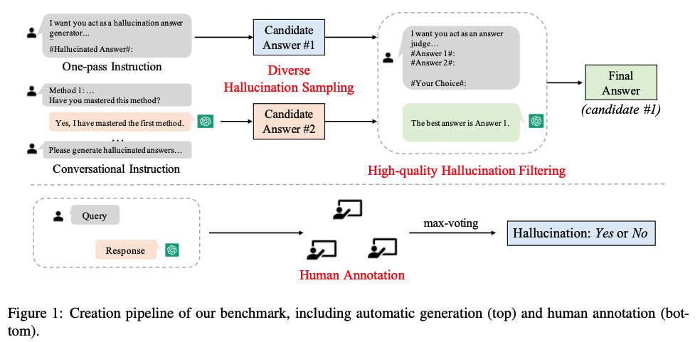

# HaluEval: A Hallucination Evaluation Benchmark for LLMs

This is the repo for our paper: [HaluEval: A Large-Scale Hallucination Evaluation Benchmark for Large Language Models](https://arxiv.org/abs/2305.11747). The repo contains:

- The [35K data](#data-release) used for evaluating the LLM.
- The code for [generating the data](#data-generation-process).
- The code for [evaluating the model](#evaluation).
- The code for [analyzing the model](#analysis).

## Overview

HaluEval includes 5,000 general user queries with ChatGPT responses and  30,000 task-specific examples from three tasks, i.e.,
question answering, knowledge-grounded dialogue, and text summarization. 

For general user queries, we adopt the 52K instruction tuning dataset from [Alpaca](https://github.com/tatsu-lab/stanford_alpaca).
To further screen user queries where LLMs are most likely to produce hallucinations, we use ChatGPT to sample three responses 
for each query and finally retain the queries with low-similarity responses for human labeling.

Furthermore, for the task-specific examples in HaluEval, we design an automatic approach to generate hallucinated samples. 
First, based on existing task datasets (e.g., HotpotQA) as seed data, we design task-specific instructions for ChatGPT
to generate hallucinated samples in two methods, i.e., one-pass and conversational. Second, to select
the most plausible and difficult hallucinated sample for LLMs evaluation, we elaborate the filtering instruction enhanced 
by ground-truth examples and leverage ChatGPT for sample selection.

<a href="https://github.com/RUCAIBox/HaluEval" target="_blank"></a>

## Data Release

The directory [`data`](./data) contains 35K generated and human-annotated hallucinated samples we used in our experiments.
There are four JSON files as follows:

- [`qa_data.json`](./data/qa_data.json): 10K hallucinated samples for QA based on [HotpotQA](https://hotpotqa.github.io/) as seed data. 
For each sample dictionary, the fields `knowledge`, `question`, and `right_answer` refer to the knowledge from Wikipedia, question text, and ground-truth answer collected from HotpotQA. The field `hallucinated_answer` is the generated hallucinated answer correspondingly.
- [`dialogue_data.json`](./data/dialogue_data.json): 10K hallucinated samples for dialogue based on [OpenDialKG](https://github.com/facebookresearch/opendialkg) as seed data. 
For each sample dictionary, the fields `knowledge`, `dialogue_history`, and `right_response` refer to the knowledge from Wikipedia, dialogue history, and ground-truth response collected from OpenDialKG. The field `hallucinated_response` is the generated hallucinated response correspondingly.
- [`summarization_data.json`](./data/summarization_data.json): 10K hallucinated samples for summarization based on [CNN/Daily Mail](https://github.com/abisee/cnn-dailymail) as seed data. 
For each sample dictionary, the fields `document` and `right_summary` refer to the document and ground-truth summary collected from CNN/Daily Mail. The field `hallucinated_summary` is the generated hallucinated summary correspondingly.
- [`general_data.json`](./data/general_data.json): 5K human-annotated samples for ChatGPT responses to general user queries from [Alpaca](https://github.com/tatsu-lab/stanford_alpaca).
For each sample dictionary, the fields `user_query`, `chatgpt_response`, and `hallucination_label` refer to the posed user query, ChatGPT response, and hallucination label (Yes/No) annotated by humans.

Based on these data, you can evaluate the ability of LLMs to recognize hallucinations and analyze what type of contents/topics LLMs tend to hallucinate (or fail to recognize the contained hallucination). 

## Data Generation Process

We executed the data generation pipeline via ChatGPT according to the following steps:

- First, we download the training sets of HotpotQA, OpenDialKG, and CNN/Daily Mail.

```
cd generation
wget http://curtis.ml.cmu.edu/datasets/hotpot/hotpot_train_v1.1.json
wget https://raw.githubusercontent.com/facebookresearch/opendialkg/main/data/opendialkg.csv
wget https://huggingface.co/datasets/ccdv/cnn_dailymail/blob/main/cnn_stories.tgz
```

- Second, we sample 10K samples and generate their hallucinated counterparts by setting the task
and sampling strategy.
  - `seed_data`: the downloaded training sets of HotpotQA, OpenDialKG, and CNN/Daily Mail.
  - `task`: sampled tasks, i.e., `qa`, `dialogue`, or `summarization`.
  - `strategy`: sampling strategy, i.e., `one-turn` or `multi-turn`. (one-pass and conversational in our paper)
```
python generate.py --seed_data hotpot_train_v1.1.json --task qa --strategy one-turn
```

- Finally, we select the most plausible and difficult hallucinated sample from these two sampling methods. 
The final selected samples will be stored in the `data` directory. 
  - `task`: filtered task, i.e., `qa`, `dialogue`, or `summarization`.

```
python filtering.py --task qa
```

Users can use our provided instructions and codes on their own datasets to generate hallucinated samples.

## Evaluation

In evaluation, we randomly sample a ground-truth or a hallucinated output for each data. For example, if the text is a hallucinated answer, the LLM should recognize the hallucination and output "Yes", which means the text contains hallucinations. If the text is a ground-truth answer, the LLM should output "No" indicating that there is no hallucination.
    
- `task`: evaluated task, i.e., `qa`, `dialogue`, or `summarization`.
- `model`: evaluated model, e.g., ChatGPT (`gpt-3.5-turbo`), GPT-3 (`davinci`).

```
cd evaluation
python evaluate.py --task qa --model gpt-3.5-turbo
```


## Analysis

Based on the samples that LLMs succeed or fail to recognize, we can analyze the topics of these samples using LDA.

- `task`: analyzed task, i.e., `qa`, `dialogue`, or `summarization`.
- `result`: the file of recognition results at the evaluation stage.
- `category`: `all` (all task samples), `failed` (task samples that LLMs fail to recognize hallucinations)

```
cd analysis
python analyze.py --task qa --result ../evaluation/qa/qa_gpt-3.5-turbo_result.json --category all
```

## License

HaluEval uses [MIT License](./LICENSE).

## Reference

Please cite the repo if you use the data or code in this repo.

```
@misc{HaluEval,
  author = {Junyi Li and Xiaoxue Cheng and Wayne Xin Zhao and Jian-Yun Nie and Ji-Rong Wen },
  title = {HaluEval: A Large-Scale Hallucination Evaluation Benchmark for Large Language Models},
  year = {2023},
  journal={arXiv preprint arXiv:2305.11747},
  url={https://arxiv.org/abs/2305.11747}
}
```


